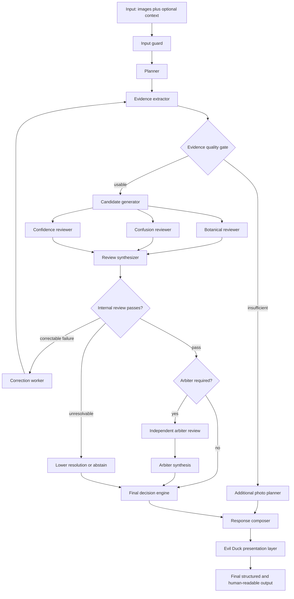

# Evil Duck Dendro Inspector

[](LICENSE)
[](pyproject.toml)

An eval-driven, evidence-based, multimodal agent for identifying trees, logs, bark, leaves,
fruit, cones and wood from photographs.

**What it is:** an executable agent graph that separates what it *sees* from what it
*infers*, reviews its own conclusions from three angles, escalates disputed or high-risk
results to an independent second model, and is architecturally permitted to answer "I do
not know — send me this photograph instead."

**What it is not:** a tree identification app, a dataset, or a source of botanical truth.
Dendrology is the *reference domain*; the engineering subject is evidence handling, review,
calibrated uncertainty, evaluation and CI. The 25-taxon knowledge pack shipped here is
demonstration content that no dendrologist has reviewed.

**It is not a replacement for professional identification.** Do not use it to decide
whether a tree is safe, whether timber is what a seller claims, or whether a plant is
edible.

## Why it is built this way

Most photo-identification agents fail the same way: they return a confident species name
from a photograph that could not possibly support one. Five design decisions target that
directly.

1. **Observations and inferences are different types.** "Bark flakes lift at thin irregular
   edges" and "this is compatible with Pinus" cannot be stored in the same field. An
   inference must name the observation ids it rests on, and those ids must exist.
2. **Evidence is ranked, and the best available rank caps the answer.** Fruit beats foliage
   beats bark. Bark tops out at *low* confidence however characteristic it looks — which
   makes the most common failure in this domain structurally impossible rather than merely
   discouraged.
3. **Detachable evidence must be shown to be attached.** A leaf at the edge of the frame may
   belong to the tree next door, so every leaf, fruit and cone observation answers that
   question explicitly — `confirmed_attached`, `confirmed_detached` or `unknown`. Only the
   first counts; the other two are recorded, reported, and cannot move the verdict.
   Three states rather than two, because a boolean turns "I could not tell" into "definitely
   not attached", which is a different and stronger claim.
4. **The claim is capped by the data, not by the model's tone.** A taxon card that supports
   only genus cannot produce a species answer, no matter how certain the model sounded.
5. **The personality layer cannot touch the verdict.** The factual answer is composed first;
   the Evil Duck voice is applied afterwards, and a contract check fails the run if the
   taxon, resolution, confidence — or the tone layer's own permission to be sharp — moved.

The last one has teeth: sharpness is a conjunction of conditions computed from the evidence
(a rejected user version, high confidence, foliage-or-better, no restraint findings, no close
alternatives, no field context from the user). Being corrected outranks all of them. Angry,
but not stupid.

## Quickstart — no API key required

```bash
git clone <your-fork-url> && cd evil-duck-dendro-inspector
python -m venv .venv && . .venv/bin/activate      # Windows: .venv\Scripts\activate
pip install -e ".[dev]"

evil-duck graph                                    # print the executable agent graph
evil-duck inspect --fake primary-pass --image examples/log.jpg --location "Kyiv Oblast, Ukraine"
evil-duck eval --suite public                      # run the nine public evaluation cases
pytest                                             # full test suite, offline
```

Answers are in Ukrainian by default, as the domain prompt specifies. Add `--lang en` for
English. You can state your own version and it will be ruled on rather than ignored:

```bash
evil-duck inspect --image examples/trunk.jpg --claim "дуб" --field-context
```

`--field-context` says you know things the photograph cannot show — foliage out of frame,
the fruit, where the tree was felled. It blocks the system from contradicting you sharply,
because in that situation you have evidence it does not.

### Register

The presentation register is a deployment choice, kept separate from the dendrology policy:

```bash
EVIL_DUCK_TONE_PROFILE=evil_duck_public   # default — dry, direct, workplace-safe
EVIL_DUCK_TONE_PROFILE=evil_duck          # the author's original register
```

Profiles live in `prompts/personality/` and carry vocabulary only. Switching profile changes
how an answer sounds and can never change what it says — a contract test proves the
decisions are byte-identical across both.

`--fake <scenario>` replays a recorded scenario from `evals/fixtures/` instead of calling a
model. Every test, every evaluation case and the whole CI pipeline run this way: no
credentials, no network, no cost, no flake. The image path does not need to exist in fake
mode — the fixture supplies the evidence, and the missing file is recorded as a limitation.

To use real models, copy `.env.example` to `.env` and set the provider and key:

```bash
EVIL_DUCK_PRIMARY_PROVIDER=openai      # plan, extract, generate, review
EVIL_DUCK_ARBITER_PROVIDER=anthropic   # independently challenge disputed results
```

## The domain prompt

The dendrology system prompt at `prompts/domain/system-prompt.md` is an **opaque,
user-managed artifact**. This project loads it, hashes it, and passes it to models unchanged
— it never translates, shortens, reformats or "improves" it. A contract test asserts the
bytes reaching the composed prompt equal the bytes on disk, whitespace and line endings
included.

It is also the **primary knowledge source** for everything else here. The evidence
hierarchy, the taxon cards, the tone gating and four of the nine evaluation cases are
derived from it. When it changes, those derivations should be revisited — but the file
itself is edited only by its owner.

```bash
evil-duck prompt-info      # path, byte count and sha256 of what is actually loaded
```

Point somewhere else to run against your own:

```bash
export EVIL_DUCK_DOMAIN_PROMPT_PATH=/path/to/your/prompt.md
```

A missing file is a loud, specific error — never a silent default. A file carrying the
placeholder marker makes the CLI and every trace say so. The SHA-256 appears in every
execution trace, so any answer can be tied back to the exact prompt bytes that produced it.

## The graph



`evil-duck graph` renders this from the same declaration the executor walks, so the picture
cannot drift from the code. Details in [docs/agent-graph.md](docs/agent-graph.md).

## What it can answer

A run returns one of five things, per subject in the frame:

| Outcome | Meaning |
| --- | --- |
| `identified` | The evidence supports the claim at the stated level, with high confidence |
| `probable` | Best supported hypothesis, honestly hedged |
| `insufficient_evidence` | Nothing defensible, plus the photograph that would fix it |
| `conflicting_evidence` | Visible evidence contradicts the leading candidate's own card |
| `unsupported_user_claim` | What you said it is does not match what the image shows |

Resolution is one of `family`, `genus`, `species_group`, `species`, `unknown`. **It is never
forced to species.** For bark, genus is the ceiling and low confidence is the cap.

If you supplied your own version, it gets its own ruling: `accepted`, `possible`, `doubtful`
or `rejected`. Rejection is deliberately hard to reach — it needs contrary evidence above
bark level and no field context from you.

## Documentation

| Document | Covers |
| --- | --- |
| [docs/architecture.md](docs/architecture.md) | Contracts, layering, why taxon cards are data |
| [docs/agent-graph.md](docs/agent-graph.md) | Node responsibilities, routing, retry and stop conditions |
| [docs/model-roles.md](docs/model-roles.md) | Primary vs arbiter, escalation policy |
| [docs/evaluation.md](docs/evaluation.md) | Metrics, the five cases, how to add one |
| [docs/review-pipeline.md](docs/review-pipeline.md) | Finding admissibility and reason codes |
| [docs/regional-packs.md](docs/regional-packs.md) | Regional priors and how they are constrained |
| [docs/dataset-policy.md](docs/dataset-policy.md) | Placeholder content, images, licensing, PII |
| [SECURITY.md](SECURITY.md) | Vulnerability reporting and prompt-injection handling |
| [CONTRIBUTING.md](CONTRIBUTING.md) | Setup, gates, PR expectations |
| [AGENTS.md](AGENTS.md) | Rules for humans and coding agents working in this repo |

## Status

v0.2.1 — a working vertical slice, not a production system. The graph runs end to end, the
contracts are enforced, the nine-case evaluation suite is deterministic and frozen against a
baseline, and CI is green. The knowledge pack is 25 taxa of demonstration content that no
dendrologist has reviewed — every card says so in its `provenance` block.

What the numbers do and do not prove:

| Claim | Supported? |
| --- | --- |
| Specification conformance against the domain prompt | yes |
| Architectural behaviour under the declared contracts | yes |
| Regression protection against silent drift | yes |
| Calibration policy — no claim outruns its evidence tier | yes |
| **Identification accuracy on real photographs** | **no — not measured** |

Provider adapters are integration boundaries rather than hardened clients, and nothing here
has been validated against real photographs at scale.

Intentionally deferred items are listed in [CHANGELOG.md](CHANGELOG.md).

## License

[Apache-2.0](LICENSE). See [NOTICE](NOTICE) for attribution and for the status of the
domain prompt and knowledge cards.
