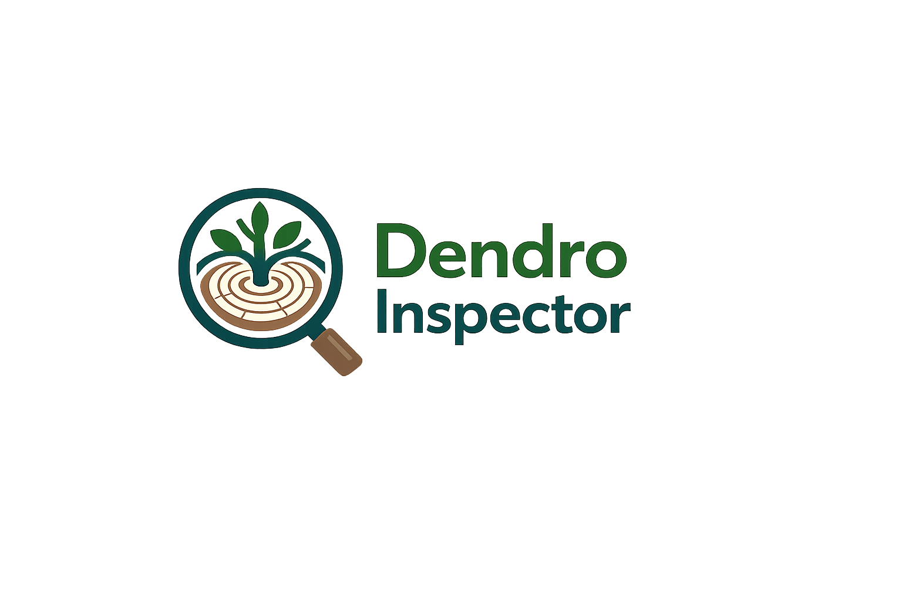
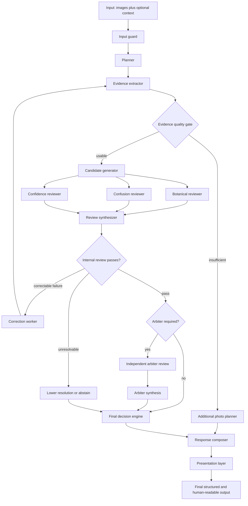

# Dendro Inspector

<p align="center">
  
</p>

[](LICENSE)
[](pyproject.toml)

An eval-driven, evidence-based, multimodal agent for identifying trees, logs, bark, leaves,
fruit, cones and wood from photographs.

**What it is:** an executable agent graph that separates what it *sees* from what it
*infers*, reviews its own conclusions from three angles, escalates disputed or high-risk
results to an independent second model, and is architecturally permitted to answer "I do
not know — send me this photograph instead."

**What it is not:** a tree identification app, a dataset, or a source of botanical truth.
Dendrology is the *reference domain*; the engineering subject is evidence handling, review,
calibrated uncertainty, evaluation and CI. The 25-taxon knowledge pack shipped here is
demonstration content that no dendrologist has reviewed.

**It is not a replacement for professional identification.** Do not use it to decide
whether a tree is safe, whether timber is what a seller claims, or whether a plant is
edible.

## Why it is built this way

Most photo-identification agents fail the same way: they return a confident species name
from a photograph that could not possibly support one. Five design decisions target that
directly.

1. **Observations and inferences are different types.** "Bark flakes lift at thin irregular
   edges" and "this is compatible with Pinus" cannot be stored in the same field. An
   inference must name the observation ids it rests on, and those ids must exist.
2. **Evidence authority is projected before it is used.** Only same-subject image evidence
   can positively support identification. Fruit beats foliage beats bark, but partial or
   low-reliability evidence is capped, and contextual, obscured or unattached evidence cannot
   raise a claim. Inferences inherit the weakest trust of every source observation.
3. **Candidates must earn admission against their own card.** Unknown taxa, cross-subject
   citations and evidence that does not exactly match the proposed taxon's declared features
   are removed. If every candidate fails, the result is an explicit abstention rather than a
   best-effort guess.
4. **Resolution and identity move together.** A species proposal broadened to genus or family
   returns that declared broader id and display name, never the original species name under a
   broader resolution label. Missing broader identity means `unknown`.
5. **The personality layer cannot touch the verdict.** The factual answer is composed first;
   the presentation register is applied afterwards, and a contract check fails the run if the
   taxon, resolution, confidence — or the tone layer's own permission to be sharp — moved.

The last one has teeth: sharpness is a conjunction of conditions computed from the evidence
(a rejected user version, high confidence, foliage-or-better, no restraint findings, no close
alternatives, no field context from the user). Being corrected outranks all of them. Angry,
but not stupid.

Review follows the same boundary. Deterministic findings are adjudicated before model findings,
so a model cannot preempt a check by restating its category. A rerank changes the answer only
when its exact `rerank_candidates` finding is accepted together with a validated same-subject
ranking; recommendations floating elsewhere in a review are inert.

## Quickstart — no API key required

```bash
git clone <your-fork-url> && cd dendro-inspector
python -m venv .venv && . .venv/bin/activate      # Windows: .venv\Scripts\activate
pip install -e ".[dev,images]"                    # 'images' bounds the bytes each call sends

dendro graph                                    # print the executable agent graph
dendro inspect --fake primary-pass --image examples/log.jpg --location "Kyiv Oblast, Ukraine"
dendro eval --suite public                      # run the nineteen public conformance cases
pytest                                             # full test suite, offline
```

Answers are in Ukrainian by default, as the domain prompt specifies. Add `--lang en` for
English. You can state your own version and it will be ruled on rather than ignored:

```bash
dendro inspect --image examples/trunk.jpg --claim "дуб" --field-context
```

`--field-context` says you know things the photograph cannot show — foliage out of frame,
the fruit, where the tree was felled. It blocks the system from contradicting you sharply,
because in that situation you have evidence it does not.

### Register

The presentation register is a deployment choice, kept separate from the dendrology policy:

```bash
DENDRO_TONE_PROFILE=standard   # default — dry, direct, workplace-safe
DENDRO_TONE_PROFILE=direct          # the author's original register
```

Profiles live in `prompts/personality/` and carry vocabulary only. Switching profile changes
how an answer sounds and can never change what it says — a contract test proves the
decisions are byte-identical across both.

`--fake <scenario>` replays a recorded scenario from `evals/fixtures/` instead of calling a
model. Every test, every evaluation case and the whole CI pipeline run this way: no
credentials, no network, no cost, no flake. The image path does not need to exist in fake
mode — the fixture supplies the evidence, and the missing file is recorded as a limitation.

To use real models, copy `.env.example` to `.env` and set the provider and key:

```bash
DENDRO_PRIMARY_PROVIDER=openai      # plan, extract, generate, review
DENDRO_ARBITER_PROVIDER=anthropic   # independently challenge disputed results
```

`.env` is read at startup; anything already exported in the environment wins over it.

Either role can also be bound to `gemini` (reads `GEMINI_API_KEY`, no SDK) or to `ollama`,
which needs no key at all — just a local `ollama serve` and a vision-capable model pulled
onto the machine. Both speak narrower schema dialects than Pydantic emits, so requests are
translated per provider without ever relaxing what the response is validated against. See
[docs/model-roles.md](docs/model-roles.md).

## The domain prompt

The dendrology system prompt at `prompts/domain/system-prompt.md` is an **opaque,
user-managed artifact**. This project loads it, hashes it, and passes it to models unchanged
— it never translates, shortens, reformats or "improves" it. A contract test asserts the
bytes reaching the composed prompt equal the bytes on disk, whitespace and line endings
included.

It is also the **primary knowledge source** for everything else here. The evidence hierarchy,
taxon cards, tone gating and public conformance cases are derived from it. When it changes,
those derivations should be revisited — but the file itself is edited only by its owner.

```bash
dendro prompt-info      # prompt/manifest hashes, policy revision and compatibility status
```

The runtime validates `prompts/versions.yaml` before constructing any provider. That manifest
pins policy revision `0.3.0`, the canonical domain prompt path and hash, the node-prompt root
and revision, and the exact node-prompt file set and hashes. Composition uses the cached
validated bytes, so a prompt changed after validation cannot silently enter a request.

Replacing the prompt therefore changes its hash, and the manifest has to be re-sealed before
the next run — including when you replace it at its own default path:

```bash
dendro prompt-seal            # dry run: every hash it would change, old -> new
dendro prompt-seal --write    # rewrite the configured manifest, then revalidate
```

Re-sealing attests bytes, not semantic compatibility: it records what is on disk and never
rewrites `schema_version` or `policy_revision`. Whether a changed prompt still means what the
deterministic policy expects is a review, not a hash. The same command re-seals node prompts
under `prompts/nodes/`, whose hashes are pinned by the same manifest.

Point somewhere else only with a matching deployment manifest:

```bash
export DENDRO_DOMAIN_PROMPT_PATH=/path/to/your/prompt.md
export DENDRO_PROMPT_MANIFEST_PATH=/path/to/your/versions.yaml
```

The external manifest is an explicit compatibility attestation, not a mechanical proof that
two natural-language prompts mean the same thing. A missing file, path mismatch, hash mismatch
or incompatible policy revision is a loud `PromptPolicyError`, never a silent default. Prompt
and manifest hashes appear in every execution trace, tying an answer to the exact admitted
bundle.

## The graph



`dendro graph` renders this from the same declaration the executor walks, so the picture
cannot drift from the code. Details in [docs/agent-graph.md](docs/agent-graph.md).

## What it can answer

A run returns one of five things, per subject in the frame:

| Outcome | Meaning |
| --- | --- |
| `identified` | The evidence supports the claim at the stated level, with high confidence |
| `probable` | Best supported hypothesis, honestly hedged |
| `insufficient_evidence` | Nothing defensible, plus the photograph that would fix it |
| `conflicting_evidence` | Visible evidence contradicts the leading candidate's own card |
| `unsupported_user_claim` | What you said it is does not match what the image shows |

Resolution is one of `family`, `genus`, `species_group`, `species`, `unknown`. **It is never
forced to species.** For bark, genus is the ceiling and low confidence is the cap. The selected
taxon id and display name always identify a taxon at that final resolution; when a card has no
declared identity broad enough for the bound, the result is `unknown`.

If you supplied your own version, it gets its own ruling: `accepted`, `possible`, `doubtful`
or `rejected`. Rejection is deliberately hard to reach — it needs contrary evidence above
bark level and no field context from you.

## Documentation

| Document | Covers |
| --- | --- |
| [docs/architecture.md](docs/architecture.md) | Contracts, layering, why taxon cards are data |
| [docs/agent-graph.md](docs/agent-graph.md) | Node responsibilities, routing, retry and stop conditions |
| [docs/model-roles.md](docs/model-roles.md) | Primary vs arbiter, escalation policy |
| [docs/evaluation.md](docs/evaluation.md) | Public conformance cases, metrics, how to add one |
| [docs/review-pipeline.md](docs/review-pipeline.md) | Finding admissibility and reason codes |
| [docs/regional-packs.md](docs/regional-packs.md) | Regional priors and how they are constrained |
| [docs/dataset-policy.md](docs/dataset-policy.md) | Placeholder content, images, licensing, PII |
| [SECURITY.md](SECURITY.md) | Vulnerability reporting and prompt-injection handling |
| [CONTRIBUTING.md](CONTRIBUTING.md) | Setup, gates, PR expectations |
| [AGENTS.md](AGENTS.md) | Rules for humans and coding agents working in this repo |

## Status

v0.3.0 — a correctness-hardened vertical slice, not a production system. The graph runs end
to end; trusted candidate-specific evidence, wood-surface provenance, split-firewood scope,
deterministic finding precedence, finding-bound reranks and prompt-policy compatibility are
enforced in code. The public suite defines nineteen deterministic conformance cases, all
passing with zero overconfidence against the frozen `public-v0.3.0` baseline. The
knowledge pack is 25 taxa of demonstration content that no dendrologist has reviewed — every
card says so in its `provenance` block.

What the numbers do and do not prove:

| Claim | Supported? |
| --- | --- |
| Specification conformance against the domain prompt | yes |
| Architectural behaviour under the declared contracts | yes |
| Regression protection against silent drift | yes |
| Calibration policy — no claim outruns its evidence tier | yes |
| **Identification accuracy on real photographs** | **no — not measured** |

Provider adapters are integration boundaries rather than hardened clients, and nothing here
has been validated against real photographs at scale.

Intentionally deferred items are listed in [CHANGELOG.md](CHANGELOG.md).

## License

[Apache-2.0](LICENSE). See [NOTICE](NOTICE) for attribution and for the status of the
domain prompt and knowledge cards.
