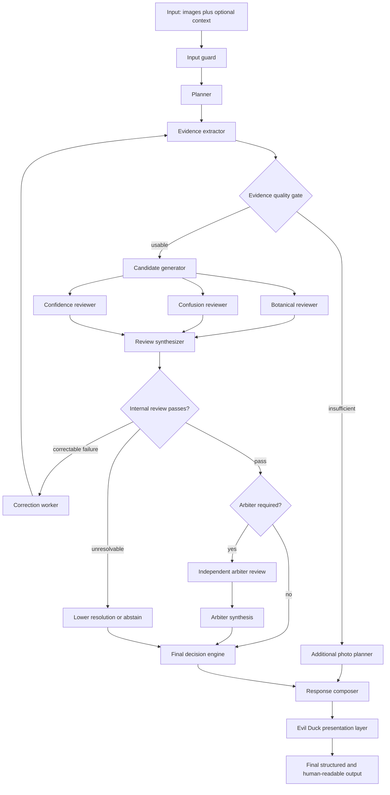

# Agent graph

- **Status:** Current
- **Owner:** Evil Duck Dendro Inspector maintainers
- **Date:** 2026-07-25
- **Last-verified:** 2026-07-25

The graph is declared once in
[`graph/definition.py`](../src/evil_duck_dendro/graph/definition.py). The diagram below,
the output of `evil-duck graph`, and the topology the executor walks are all rendered or
validated from that declaration, so the picture cannot drift from the code. A contract test
asserts that every routing target is a declared edge.

`input`, `output` and `internal_gate` are rendering pseudo-nodes. The first two mark the
boundary; `internal_gate` is a pure routing decision over the review synthesis rather than a
node with side effects.

## Nodes

| Node | Model? | Responsibility | Typed output |
| --- | --- | --- | --- |
| `input_guard` | no | Record instruction-like content, missing files, user pushback | `GuardReport` |
| `planner` | primary | Decide which features to look for | `InspectionPlan` |
| `evidence_extractor` | primary | Enumerate subjects, observations, inferences, limitations | `EvidencePacket` |
| `evidence_quality` | no | Decide whether any claim is possible | `EvidenceQualityReport` |
| `photo_planner` | no | Convert "not enough" into a specific photo request | `FinalDecision[]` |
| `candidate_generator` | primary | Ranked hypotheses per subject; strip evidence leaks | `CandidateSet[]` |
| `botanical_reviewer` | primary | Botany; card-declared contradictions | `ReviewResult` |
| `confusion_reviewer` | primary | Look-alikes, colour dependence, region assumptions | `ReviewResult` |
| `confidence_reviewer` | primary | Calibration, earned resolution, invalid negatives | `ReviewResult` |
| `review_synthesizer` | no | Adjudicate findings against admissibility rules | `ReviewSynthesis` |
| `correction_worker` | no | Spend one retry, clear derived state | state |
| `abstain` | no | Lower the claim, mark the run abstained | state |
| `escalation_gate` | no | Decide whether the arbiter is worth calling | `EscalationDecision` |
| `arbiter` | **arbiter** | Independent challenge | `ReviewResult` |
| `arbiter_synthesizer` | no | Same admissibility bar as internal review | `ReviewSynthesis` |
| `final_decision` | no | Cap, downgrade, classify | `FinalDecision[]` |
| `response_composer` | no | Structured result plus the five-part text | `CaseResponse` |
| `tone_layer` | no | Voice only; contract-checked | `CaseResponse` |

Every node has one responsibility, takes typed input, returns typed output, writes an
execution event, and is testable on its own without a provider.

## Routing rules

| At | Condition | Goes to |
| --- | --- | --- |
| `evidence_quality` | `quality.sufficient` | `candidate_generator` |
| | otherwise | `photo_planner` |
| `internal_gate` | `synthesis.unresolvable` | `abstain` |
| | `retry_required` and `retries < budget` | `correction_worker` |
| | `retry_required` and budget spent | `abstain` |
| | otherwise | `escalation_gate` |
| `escalation_gate` | `escalation.required` | `arbiter` |
| | otherwise | `final_decision` |

Precedence at the internal gate matters. An unresolvable finding must not be retried, and a
retry request with no budget left degrades to abstention rather than looping.

## Parallelism

The three reviewers are independent and run concurrently as one logical step. They receive
the same input state, and the executor merges only the reviews each one *appended* — a
reviewer that tried to change anything else has its change discarded, which is the intended
contract rather than a silent race. Events are recorded after the gather so trace order
follows the declared fan-out order rather than whichever coroutine finished first.

## Retry and stop conditions

**Budget: 1** (`GraphConfig.retry_budget`).

A retry is requested only by an accepted finding with `required_action:
re_extract_evidence` — for example, features recorded as absent that were really just not
visible. The correction worker then:

1. increments `retries` and records it in the trace;
2. hands the accepted corrections to the extractor, which appends them to its prompt;
3. **clears** `candidate_sets`, `reviews`, `synthesis` and `quality`, so the second pass
   cannot inherit the first pass's conclusions.

When the budget is spent the graph does one of: lower taxonomic resolution, request a
targeted photograph, or abstain. It never loops. See
[`docs/architecture.md`](architecture.md#termination) for the termination argument, and
`tests/unit/test_routing.py` for the branch-by-branch tests.

`max_steps` (default 64) is a backstop against a routing bug, not the primary guarantee. It
raises `GraphExecutionError` rather than returning a degraded answer.

## Execution paths

| Scenario | Nodes executed |
| --- | --- |
| Clean genus answer | 13 — guard through tone, no arbiter |
| Insufficient evidence | 7 — quality gate diverts to photo planner |
| Escalated | 15 — plus arbiter and arbiter synthesis |
| One retry | 13 + 6 re-run nodes |

## Adding a node

1. add the name to `NodeName` and `NODE_KINDS`, plus a label in `DISPLAY_LABELS`;
2. wire its edges into `GRAPH_EDGES`;
3. add the routing rule to `graph/routing.py`;
4. implement `async def run(state, ctx) -> GraphState` in `nodes/`;
5. register it in `nodes/__init__.py:build_registry`.

The contract tests fail if you miss any of these: `validate_definition()` catches an
unwired node, the registry check catches a missing implementation, and the routing-target
test catches an edge you route to but did not declare.

## Implementation references

- [`src/evil_duck_dendro/graph/definition.py`](../src/evil_duck_dendro/graph/definition.py)
- [`src/evil_duck_dendro/graph/routing.py`](../src/evil_duck_dendro/graph/routing.py)
- [`src/evil_duck_dendro/graph/executor.py`](../src/evil_duck_dendro/graph/executor.py)
- [`tests/contract/test_graph_contract.py`](../tests/contract/test_graph_contract.py)
