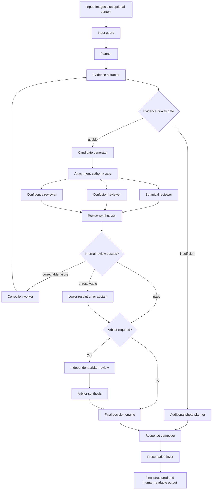

# Agent graph

- **Status:** Current
- **Owner:** Dendro Inspector maintainers
- **Date:** 2026-09-05
- **Last-verified:** 2026-09-05

The graph is declared once in
[`graph/definition.py`](../src/dendro_inspector/graph/definition.py). The diagram below,
the output of `dendro graph`, and the topology the executor walks are all rendered or
validated from that declaration, so the picture cannot drift from the code. A contract test
asserts that every routing target is a declared edge.

`input`, `output` and `internal_gate` are rendering pseudo-nodes. The first two mark the
boundary; `internal_gate` is a pure routing decision over the review synthesis rather than a
node with side effects.

## Nodes

| Node | Model? | Responsibility | Typed output |
| --- | --- | --- | --- |
| `input_guard` | no | Record instruction-like content, missing files, user pushback | `GuardReport` |
| `planner` | primary | Decide which features to look for | `InspectionPlan` |
| `evidence_extractor` | primary | Enumerate identity scopes/components and normalize components to their roots | `EvidencePacket` |
| `evidence_quality` | no | Decide whether any claim is possible | `EvidenceQualityReport` |
| `photo_planner` | no | Convert "not enough" into a specific photo request | `FinalDecision[]` |
| `candidate_generator` | primary | Propose rankings; admit only known, same-subject, card-matched support | `CandidateSet[]` |
| `botanical_reviewer` | reviewer | Botany; card-declared contradictions | `ReviewResult` |
| `confusion_reviewer` | reviewer | Look-alikes, colour dependence, region assumptions | `ReviewResult` |
| `confidence_reviewer` | reviewer | Calibration, earned resolution, invalid negatives | `ReviewResult` |
| `review_synthesizer` | no | Deterministic-first finding admission; bind validated reranks | `ReviewSynthesis` |
| `correction_worker` | no | Spend one retry, clear derived state | state |
| `abstain` | no | Lower the claim, mark the run abstained | state |
| `escalation_gate` | no | Store provisional verdicts, then decide whether the arbiter is worth calling | `EscalationDecision` |
| `arbiter` | **arbiter** | Independent challenge | `ReviewResult` |
| `arbiter_synthesizer` | no | Same admissibility bar as internal review | `ReviewSynthesis` |
| `final_decision` | no | Compose bounds; select resolution-consistent identity | `FinalDecision[]` |
| `response_composer` | no | Structured result plus the five-part text | `CaseResponse` |
| `tone_layer` | no | Voice only; contract-checked | `CaseResponse` |

Every node has one responsibility, takes typed input, returns typed output, writes an
execution event, and is testable on its own without a provider.

The escalation gate calls the deterministic decision engine before it evaluates triggers.
Those `GraphState.provisional_decisions` are the verdicts the graph would return without an
arbiter. The arbiter projection reads the stored tuple rather than recomputing it, and the
trace compares it with the eventual decisions field by field.

The candidate and rerank boundaries are deliberately inside deterministic nodes. Candidate
proposals lose unknown taxa, foreign evidence and card-unmatched support before entering state.
Review synthesis stores only exact accepted finding/ranking pairs in `admitted_reranks`, and
final decision derives confidence, evidence tier, resolution and identity from admitted
candidate-specific support. The graph topology did not need a new node to enforce these rules.

## Routing rules

| At | Condition | Goes to |
| --- | --- | --- |
| `evidence_quality` | `quality.sufficient` | `candidate_generator` |
| | otherwise | `photo_planner` |
| `internal_gate` | `synthesis.unresolvable` | `abstain` |
| | `retry_required` and `retries < budget` | `correction_worker` |
| | `retry_required` and budget spent | `abstain` |
| | otherwise | `escalation_gate` |
| `escalation_gate` | `escalation.required` | `arbiter` |
| | otherwise | `final_decision` |

Precedence at the internal gate matters. An unresolvable finding must not be retried, and a
retry request with no budget left degrades to abstention rather than looping.

## Parallelism

The three reviewers are independent and run concurrently as one logical step. They receive
the same input state, and the executor merges only the reviews each one *appended* — a
reviewer that tried to change anything else has its change discarded, which is the intended
contract rather than a silent race. Events are recorded after the gather so trace order
follows the declared fan-out order rather than whichever coroutine finished first.

A failing member cancels unfinished siblings, and the executor waits for those tasks to
terminate before propagating the original exception. All member events are recorded, even
on failure or caller cancellation; cancelled members have failed status and a `cancelled`
detail. Completed members retain their provider calls and projections. Failed rounds never
merge partial reviews into the decision state.

## Retry and stop conditions

**Budget: 1** (`GraphConfig.retry_budget`).

A retry is requested only by an accepted finding with `required_action:
re_extract_evidence` — for example, features recorded as absent that were really just not
visible. The correction worker then:

1. increments `retries` and records it in the trace;
2. hands the accepted corrections to the extractor, which appends them to its prompt;
3. **clears** `candidate_sets`, `reviews`, `synthesis` and `quality`, so the second pass
   cannot inherit the first pass's conclusions.

When the budget is spent the graph does one of: lower taxonomic resolution, request a
targeted photograph, or abstain. It never loops. See
[`docs/architecture.md`](architecture.md#termination) for the termination argument, and
`tests/unit/test_routing.py` for the branch-by-branch tests.

Abstention bounds retain the subjects of the accepted blocking findings. A case-wide finding
covers every subject; a subject-specific finding leaves other subjects' bounds intact. The
escalation gate still runs afterwards so an unaffected high-confidence result receives its
normal arbitration check. A fully abstained case suppresses arbitration.

`max_steps` (default 64) is a backstop against a routing bug, not the primary guarantee. It
raises `GraphExecutionError` rather than returning a degraded answer.

## Execution paths

| Scenario | Nodes executed |
| --- | --- |
| Clean genus answer | Guard through tone, without arbitration |
| Insufficient evidence | Quality gate diverts to photo planner |
| Escalated | Adds arbiter and arbiter synthesis |
| One retry | Correction worker repeats extraction through review synthesis |

Exact executed-node counts live in each run trace.

## Adding a node

1. add the name to `NodeName` and `NODE_KINDS`, plus a label in `DISPLAY_LABELS`;
2. wire its edges into `GRAPH_EDGES`;
3. add the routing rule to `graph/routing.py`;
4. implement `async def run(state, ctx) -> GraphState` in `nodes/`;
5. register it in `nodes/__init__.py:build_registry`.

The contract tests fail if you miss any of these: `validate_definition()` catches an
unwired node, the registry check catches a missing implementation, and the routing-target
test catches an edge you route to but did not declare.

## Implementation references

- [`src/dendro_inspector/graph/definition.py`](../src/dendro_inspector/graph/definition.py)
- [`src/dendro_inspector/graph/routing.py`](../src/dendro_inspector/graph/routing.py)
- [`src/dendro_inspector/graph/executor.py`](../src/dendro_inspector/graph/executor.py)
- [`tests/contract/test_graph_contract.py`](../tests/contract/test_graph_contract.py)
